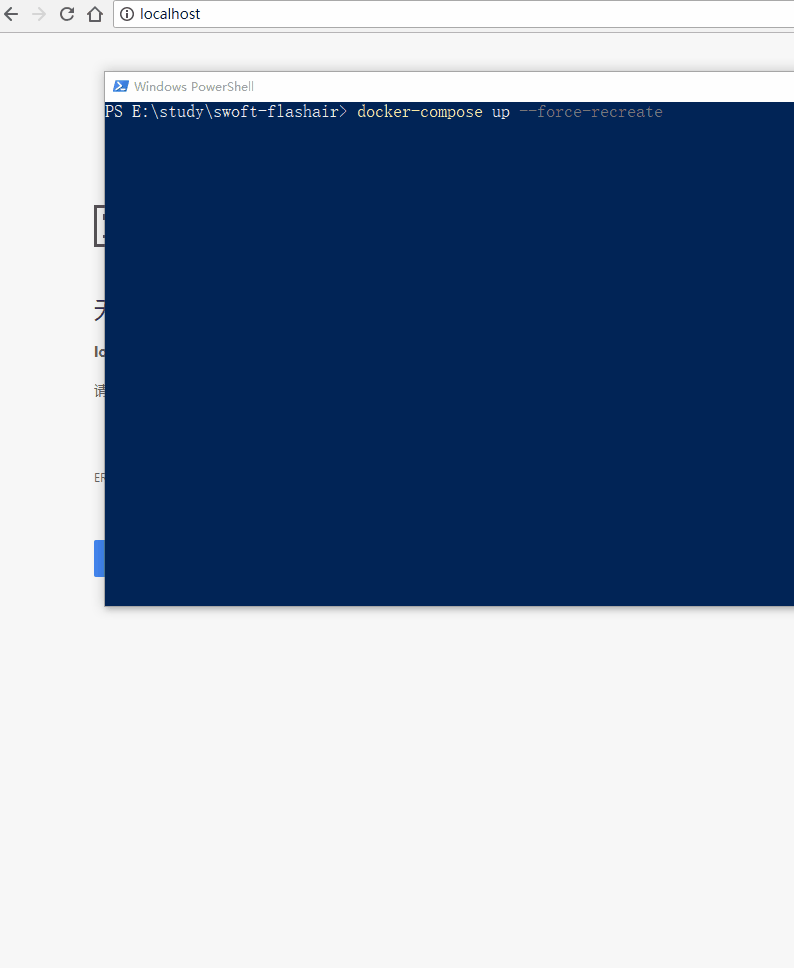

# swoft 尝试 - 从 flashair 备份文件

会用到

- websocket 与页面实时通信
- composer 安装第三方包

## 环境准备

创建项目

```
composer create-project swoft/swoft swoft-flashair
```

因为windows不支持swoole，依赖安装会因为没有swoole插件而报错，所以需要增加忽略参数

```
composer install --ignore-platform-reqs
```

启动借助于docker 

> 因为windows目录映射总是有问题，所以使用build的方式，如果目录映射没问题还是使用swoft官方镜像比较好，不用每次composer安装
>
> 如遇到同样问题可参考本仓库修改以下文件：Dockerfile、.dockerignore、docker-compose.yml

```
docker-compose build 
docker-compose up --force-recreate
```

测试运行

http://localhost

## 编码

guzzle换成swoole的http，同样要使用`--ignore-platform-reqs`

```
composer require yurunsoft/guzzle-swoole --ignore-platform-reqs
composer require guzzlehttp/guzzle --ignore-platform-reqs 
```

 最后 `yurunsoft/guzzle-swoole` 没有使用上，关键代码如下
 
 - resources/views/index/index.php 首页内容及JS处理websocket逻辑
 - app/WebSocket/EchoController.php 没有改代码，但是使用了这个websocket通信
 - app/Tasks/SyncTask.php 使用自动每秒调度任务来启动扫描flashair的流程，跟新进度会群发websocket
 - app/Models/Logic/FlashairService.php 具体flashair逻辑，跟新进度会群发websocket
 - app/Models/Logic/FlashairWorker.php 具体flashair逻辑，跟新进度会群发websocket
 - app/Models/Logic/FlashairItem.php flashair逻辑所需结构

其他配置修改参考swoft https://doc.swoft.org/

